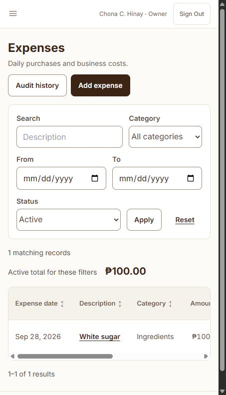

# Local Expenses repair — 2 October 2026

The application at `http://127.0.0.1:8000` uses the configured MySQL database `aling_chona_db`. The earlier `8123` server was an isolated SQLite browser fixture. Its migrated schema did not establish that the regular local MySQL database had been migrated.

## Cause and resolution

The Expenses model now uses soft deletion, but the local `expenses` table still lacked `deleted_at`. This caused the reported SQLSTATE 42S22 error. All three 2 October additive migrations were pending.

The local database was backed up privately, the backup was restored to a temporary MySQL database, and the real additive migrations were verified on that copy. A connection-name mistake in the one-off deployment helper initially applied the schema while tracking the migrations on the temporary connection. This was corrected by comparing the applied schema, constraints, upgrade indexes and baseline backfills with an independently migrated pre-upgrade backup, then reconciling the three migration records in batch 4. No business records were reset or reseeded.

- Original values across **19 business tables** were verified against the pre-upgrade backup with row counts and SHA-256 fingerprints of the original columns.
- All three migrations now show **Ran**, and maintenance mode is off.
- Actual Expenses on port 8000 renders the original **White sugar / PHP 100** record and active total. Detail, edit form, audit history, receive-stock and Reports also render on port 8000. No live expense was created/edited/voided for this check.
- Focused automated regression: **9 tests passed / 113 assertions**, including expense edit/void audit, total pagination, authorization and additive preservation.
- Local `.env` now uses `APP_URL=http://127.0.0.1:8000`; configuration/view caches were cleared.
- The agent-owned 8123 server was stopped. Codex tabs were changed to the same port-8000 application.

Private pre-upgrade backup: `storage/app/private/backups/workflow-upgrade-20261002-140057/database.sql`.

Final preservation/schema verification: `storage/app/private/backups/workflow-upgrade-20261002-140442/verification.json`. These backup files remain private and ignored by Git. Temporary verification databases were removed after verification.

Use [Expenses on the regular local app](http://127.0.0.1:8000/expenses). Refresh an already-open error page.

