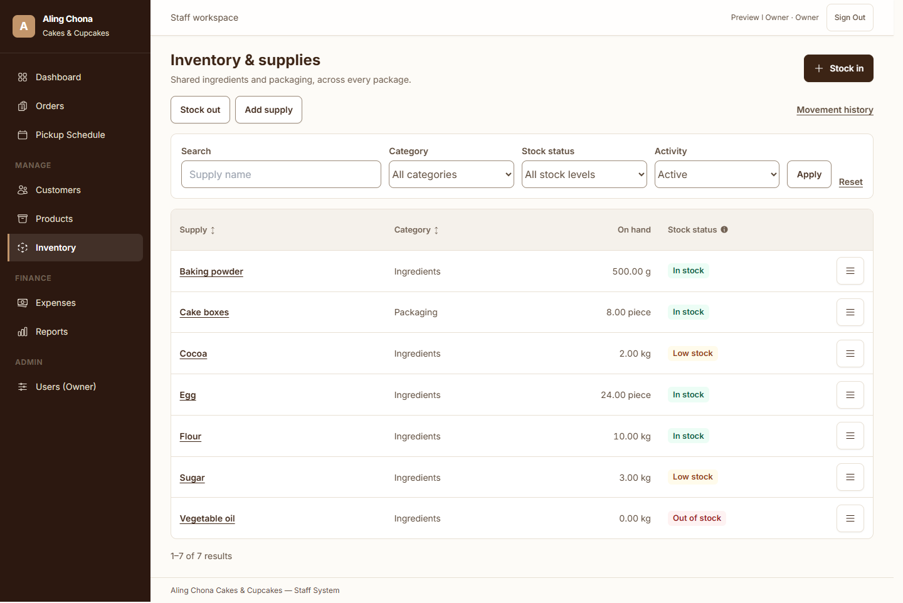
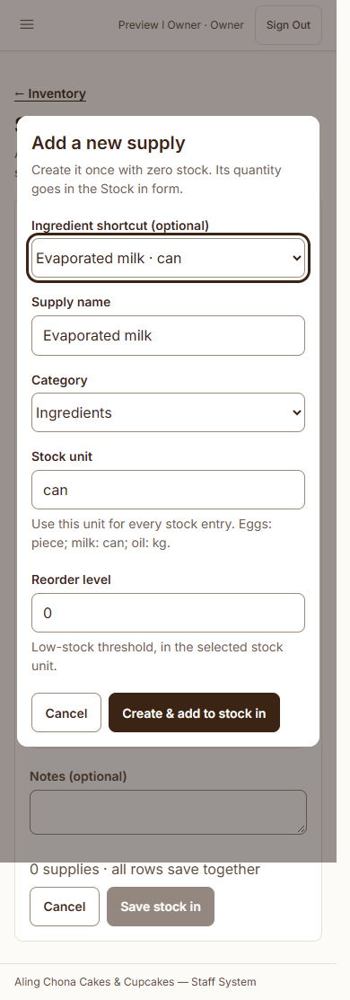

# Inventory workflow refinement — October 5, 2026

Follow-up: the ingredient-shortcut dropdown described below was subsequently removed to keep one saved inventory list. See the [current workflow and verification](../inventory-single-catalogue/report.md).

Completed the supply picker, supply creation, units and table layout changes. Existing local stock, order and receipt records were preserved.

## Operating approach and research

Create an ingredient once in the catalogue, give it one stock unit, then record quantities through Stock in. Lightspeed documents ingredient definitions with an explicit unit and separate stock updates through receipts and counts. This supports keeping catalogue setup separate from recurring stock movements. [Creating ingredients](https://resto-support.lightspeedhq.com/hc/en-us/articles/226404508-Creating-ingredients), [Stock levels](https://k-series-support.lightspeedhq.com/hc/en-us/articles/4407517612699-Stock-levels).

Purchase packaging may differ from the unit used to track stock. Odoo documents conversion into the inventory unit; such conversion requires a defined ratio. This app takes quantities in the displayed stock unit. For example, a flour bag labelled 25 kg is entered as 25 kg. Package sizes are not guessed. [Odoo units of measure](https://www.odoo.com/documentation/19.0/applications/inventory_and_mrp/inventory/product_management/configure/uom.html).

The shortcuts and fresh ingredient seed data use:

| Ingredient | Stock unit |
| --- | --- |
| Flour | kg |
| Sugar | kg |
| Cocoa | kg |
| Egg | piece |
| Evaporated milk | can |
| Vegetable oil | kg |
| Baking powder | g |
| Baking soda | g |

The kg/g choices preserve the current flour, sugar, cocoa and baking-powder conventions. Grams were also chosen for baking soda to allow small stock changes. Eggs already use pieces in the local database (`pcs`); their 75-piece balance was not converted or replaced. The updated seeder was tested in disposable databases and was not run against the local application database. Existing ingredient names and balances were not overwritten, and extra existing supplies were not deleted.

## Changes

- Find a supply has a 44-pixel dropdown button and supports both browsing and typed search. Selecting a supply keeps the list and search open, marks it Added and prevents duplicate rows. The button, outside click and Escape close the list. Arrow Down and Enter support keyboard selection.
- Stock in can create a missing supply in a native dialog, then add it to the current batch. Creation records zero stock; the quantity is recorded only when Stock in is saved. Cancelling the stock form leaves that catalogue entry at zero.
- Add supply includes ingredient shortcuts and stock-unit suggestions. Save & stock in opens the quantity form with the new supply selected; Save supply only creates its catalogue entry. Existing units remain fixed.
- On hand combines the amount and unit. Stock rows also show units beside quantity inputs and in the change and resulting-balance columns. Column proportions are scoped to inventory tables, with compact action columns and contained horizontal scrolling on phones.
- Removed the delivery-reference controls and detail label, and removed delivery wording from the operating documentation. Historical database fields remain intact for record preservation and compatibility with prior operation submissions.
- Stock out retains usage, waste and count-remaining-stock methods. Changing between a reduction and a count clears the entered value so its meaning cannot silently change.

## Verification

- Full regression suite: **152 tests, 2,087 assertions; no failures or errors**. Includes receipt isolation, authorization, stock concurrency, atomic posting, idempotency, reversals and expenses.
- New supply tests cover zero-stock quick creation, rejection of unintended opening stock, duplicate names, direct continuation to Stock in, inactive supplies, unauthorized requests, exactly-once stock posting and safe reseeding.
- Browser verification: **112 checks, 17 screenshots**, Owner and Assistant, 390- and 1440-pixel widths. Covered persistent multi-selection, search, keyboard controls, stock-count previews, inline creation, duplicate validation, grouped posting, unit labels and page overflow. No app JavaScript errors; two native Chrome view-transition cancellation notices are retained in the evidence.
- Real local database snapshots: **29 of 30 table hashes identical**. Supplies, inventory operations, movements, baselines, customers, orders, order details, payments and payment proofs were identical. The sessions table changed during concurrent use; its row count remained one. All stock-writing tests used guarded disposable databases.
- Scoped diff whitespace checks and PHP/JavaScript syntax checks passed.

Evidence: [full suite](full-suite.xml), [browser results](browser-results.json), [database comparison](data-comparison.json).

