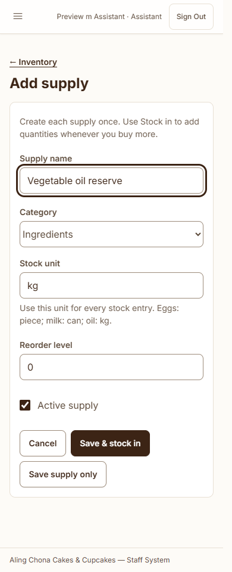

# One inventory list — October 5, 2026

Removed the Ingredient shortcut dropdown from both Add supply and the new-supply dialog inside Stock in. It was a fixed list from application configuration rather than the saved inventory, which made supply creation and stock entry confusing.

The current flow is:

1. **Add supply:** type a new ingredient name, category and stock unit, then save. This creates its inventory record with zero stock.
2. **Stock in:** select an existing inventory record and enter the quantity being added. Its dropdown reads active saved supplies from the database.

New supplies appear in the Stock in picker automatically. No manual database edits or changes to an ingredient-template list are needed. Save & stock in still opens the quantity form with the newly created supply selected. Existing-name validation, fixed stock units, opening baselines, stock posting and audit history remain intact.

The ingredient defaults used to initialize a fresh database remain seed data only. They are no longer exposed as a second list in either supply form. The seeder was not run against the local application database.

Verification: **21 tests, 376 assertions** passed; **115 browser checks and 17 screenshots** passed for Owner and Assistant at 390 and 1440 pixels. Browser checks covered direct name/unit entry, automatic appearance of newly saved supplies in the database-backed picker, duplicate-name validation, grouped stock posting, persistent selection and layouts. PHP stock writes used disposable databases. The local inventory table hashes remained identical.

Evidence: [test results](inventory-suite.xml), [browser results](browser-results.json), [database comparison](data-comparison.json).

