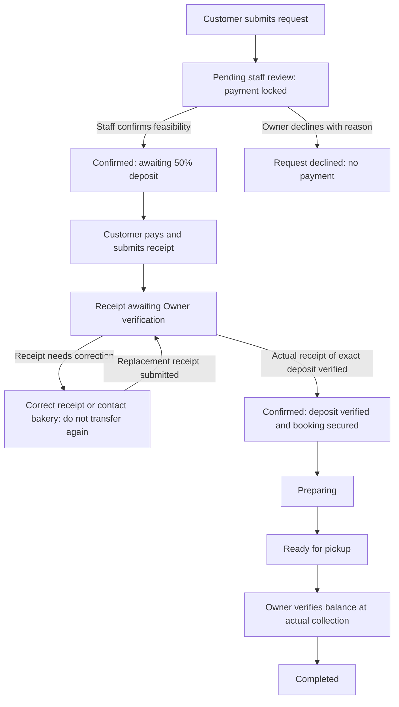

# Implementation plan: staff confirmation before payment

Date: 5 October 2026  
Status: **Planning complete; implementation has not started.**  
Project: `C:\Users\User\Desktop\IT12_Project`  
Planning HEAD: `a36fc97b4396618d8d580b47e68bc52321a617b4`  
Companion: [execution and acceptance matrix](C:/Users/User/Desktop/IT12_Project/docs/qa/2026-10-05/staff-confirmation-before-payment/execution-matrix.md).

## Requirement and intended behavior

The user relayed the professor's requirement: **staff must confirm that the bakery can fulfil an order before the customer is invited or allowed to pay through the application.** Staff should review the specifications, reference images, quantities, requested pickup, and available capacity. An impossible, unsuitable, or apparently abusive request can be declined before money is requested.

The resulting customer flow is:

**Submit request → staff confirms feasibility → 50% deposit becomes available → payment is verified → preparation → Ready for pickup → remaining balance at actual collection → Completed.**

If staff declines the request, the customer receives a reason and no payment invitation. The request and its submitted details remain available for audit. There is no invented refund or retained deposit when no verified money was received.

For a **₱2,000 order**, submission requests **₱0 now**. After staff confirmation, the customer may pay the exact **₱1,000 deposit**. Preparation starts only after that deposit is verified. The remaining **₱1,000** is collected at actual pickup using the existing atomic completion workflow.

Staff confirmation establishes that the request is feasible. Deposit verification establishes that money was received. These are separate decisions, with separate actors and timestamps. Neither an approval nor a receipt upload creates a payment ledger entry.

## Authority, scope, and planning assumptions

This requirement supersedes the earlier rule that a verified deposit is what changes `pending` to `confirmed`. It also supersedes buyer copy that immediately requests payment after submission. The [previous implementation plan](C:/Users/User/Desktop/IT12_Project/docs/qa/2026-10-05/implementation-plan/plan.md) and [verification report](C:/Users/User/Desktop/IT12_Project/docs/qa/2026-10-05/implementation-verification/report.md) remain historical records.

The following existing decisions continue: exact 50% booking deposit once; final settlement only at actual pickup after Ready for pickup; Owner financial mutations; verified collections drive reporting; customer-cancellation deposit retention; full refund of verified funds for genuine bakery failure; Philippine contact validation; pickup calendar rules; preserved catalog price snapshots and historical records.

Planning role choice: active **Owner and Assistant may confirm feasibility**, consistent with their existing normal-status permissions. **Declining a request remains Owner-only**, consistent with the current cancellation/management boundary. An Assistant can flag a concern for the Owner through existing staff coordination; this plan does not add messaging. Cash recording, receipt acceptance/rejection, pickup settlement, and refunds remain Owner-only. These are implementation defaults, not new claims about what the professor specified.

Scope covers public and staff-created orders, their private status/payment page, confirmation/decline actions, payment and receipt guards, preparation prerequisites, affected queues/copy, an additive review-audit migration, legacy compatibility, and focused verification. Staff-created requests also require an explicit confirmation action before deposit recording; creation does not silently approve a request.

The automatic GCash gateway is a **later phase**. No provider selection, gateway SDK, webhook endpoint, automatic payment collection, or automatic refund is implemented in this phase. Retain manual GCash proof verification for public deposits. No arbitrary 24-hour payment deadline, automated capacity engine, customer login, email/SMS notification, or new pricing workflow is added.

Planning creates only this folder's Markdown documents. Current unrelated UI/skeleton/navigation changes in the working tree must be preserved. Do not deploy, commit, push, run migrations against the regular database, or rewrite previous QA evidence as part of this planning request.

## Current behavior and changes required

| Area | Current behavior found in the repository | Planned behavior |
|---|---|---|
| Order creation | `OrderService` creates `pending` requests. | Continue creating `pending`, with an explicit review state of `pending`; no payment, reservation claim, or automatic approval. |
| Confirmation | `recordDownPayment()` changes the order to `confirmed`; generic confirmation requires a verified deposit. | A dedicated authenticated staff decision confirms feasibility without taking money. Deposit recording requires prior confirmation and leaves the lifecycle at `confirmed`. |
| Public status page | `pending` displays "Pending deposit verification" and immediately invites payment. | `pending` displays "Awaiting staff confirmation"; `confirmed` distinguishes awaiting deposit, receipt review, and verified deposit. |
| Receipt submission/rejection | `PaymentReviewService` permits these on `pending` orders. | Permit the normal payment workflow only after explicit approval, while the order is `confirmed` and the deposit is still unpaid. |
| QR download | `OrderPaymentPageController::qr()` checks the private token and payment settings, but does not check approval/payment eligibility. | Apply the shared eligibility rule to QR display/download, as well as receipt POST and staff deposit recording. |
| Staff proof panel | Lifecycle statuses are used as a proxy for a verified deposit. | Use ledger/proof facts; an unpaid `confirmed` order must not be labelled verified or hide an awaiting receipt. |
| Preparation | `confirmed → preparing` does not separately enforce deposit verification, because confirmation currently implies payment. | Recheck the verified-deposit prerequisite under an order lock before preparation; confirmation alone is insufficient. |
| Rejected requests | Existing cancellation records distinguish customer cancellation and bakery failure. | Introduce `cancellation_kind = staff_rejected` for a declined, unpaid request, with a required reason and recorded reviewer. Display "Request declined". |
| Queues and schedules | `confirmed` currently implies a paid booking. | Separate review, confirmed-awaiting-deposit, receipt-review, and booked work. Clearly label unpaid requests in pickup views. |

## Lifecycle and payment rules

Keep the existing `orders.status` values. The order enum does not need a new value just to represent an unpaid approval. Keep the computed `payment_status`; do not add or query a nonexistent payment-status column.

| Lifecycle / review | Customer-facing state | Payment behavior | Staff action |
|---|---|---|---|
| `pending` / `pending` | Awaiting staff confirmation | No QR, pay instruction, receipt form, or new deposit recording. | Owner/Assistant confirm; Owner declines. |
| `confirmed` / `approved`, no verified payment and no receipt awaiting review | Confirmed — awaiting deposit | Show exact deposit and approved payment instructions when configured. | Owner may record an internal deposit; public customer may submit a receipt. |
| `confirmed` / `approved`, receipt awaiting verification | Receipt received — awaiting verification | Withhold repeat-payment controls; preserve private link and receipt history. | Owner verifies actual funds or rejects the receipt with a reason. |
| `confirmed` / `approved`, verified exact deposit | Deposit verified — booking secured | No additional advance payment. | Owner/Assistant may start Preparing. |
| `preparing`, `ready_for_pickup` | Preparing / Ready for pickup | No extra advance deposit. Final balance remains a pickup action. | Existing permitted progression and Owner pickup settlement. |
| `completed` | Pickup completed | No new payment invitation. | Terminal; no second charge. |
| `cancelled` / `rejected`, kind `staff_rejected` | Request declined | No payment controls; show the customer-appropriate reason. | Terminal for this request. Customer may submit a revised request. |
| Other `cancelled` kinds | Customer cancellation / bakery failure | Existing truthful payment/refund history; no new payment controls. | Existing Owner cancellation/refund rules. |

A receipt rejection does **not** decline the order or revoke its feasibility approval. The customer can send a replacement receipt without another staff confirmation. Copy must say to correct the receipt/reference and contact the bakery if money was already sent; it must not instruct a second transfer merely because a receipt was rejected.

A declined request cannot be reopened by accepting a proof, submitting a generic status update, or replaying an old form. Revisions are new requests in this phase, avoiding silent changes to approved specifications and price snapshots. If editable specifications are introduced later, a material edit must invalidate approval before another payment is requested.

Approval should require staff acknowledgment that they reviewed the items, quantities, notes/images, pickup date/time, and capacity. Reject a normal new confirmation if its requested pickup is already past. Use the bakery pickup timezone. Do not let a browser supply review fields or approve itself.

Staff must consider confirmed requests awaiting deposits when checking capacity. Only a verified deposit is described as securing the booking. The current system has no automated slot-capacity or hold-expiry model, so this plan does not claim to prevent every scheduling conflict automatically. Do not promise a review response time that the bakery has not agreed to. If the Owner determines an approved request can no longer be fulfilled, use the existing bakery-failure workflow to close it and disable normal collection; actual received funds always need reconciliation. This phase does not invent a timed approval expiry.

## Additive database change and audit

**Unlike the previous implementation, this planned change requires a small additive migration.** Create a new migration; do not edit already-applied migrations.

| Proposed `orders` field | Shape | Purpose |
|---|---|---|
| `review_status` | Nullable string, e.g. length 24; service-controlled values `pending`, `approved`, `rejected` | Separate feasibility review from the lifecycle and money. `null` identifies a pre-change record, not automatic approval. |
| `reviewed_by` | Nullable foreign key to `users`, restrict deletion | Attribute the confirmation or decline to the actual staff reviewer; do not reuse `user_id`, which records the creator. |
| `reviewed_at` | Nullable datetime, existing UTC storage convention | Store the actual review event time and present it in the bakery timezone where needed. |

Use existing `cancellation_kind`, `cancellation_reason`, and `cancelled_at` for an unpaid decline. `staff_rejected` fits the existing string field, so avoid changing the lifecycle enum. Require a concise, respectful reason; explain feasibility or scheduling issues without publishing insults or unsupported accusations. A normal decline records no payment/reference/refund.

Existing records retain `null` review fields. Do not fabricate a staff name or approval timestamp from payment dates. New creation explicitly initializes `review_status = pending` server-side. Approval updates review fields and `status = confirmed` in one transaction. Decline updates review fields, reason, cancellation classification, and terminal status in one transaction. Replayed decisions must preserve the first review actor/time and avoid duplicate side effects.

Add model casts/relationships and guarded update methods. Explicitly prevent public mass assignment of review metadata. Add only indexes justified by the chosen review/awaiting-deposit queries. No existing payment, proof, reference, refund, customer, order-line, image, or pickup-history values are rewritten by the schema migration.

## Server enforcement and transaction boundaries

Create a focused `OrderReviewService` or equivalent action methods. Expose dedicated `POST /orders/{order}/confirm` and `POST /orders/{order}/decline` routes with capability checks and service-level checks. Confirmation requires an accepted feasibility acknowledgment; decline requires a reason and Owner authority.

The generic status endpoint must not become an alternate way to approve an unreviewed request. Reject a generic target of `confirmed` with guidance to use the review action, or delegate through exactly the same validated review command. Choose one approach consistently and test it; the preferred implementation is the dedicated review action with generic confirmation rejected.

Centralize normal deposit eligibility for controller presentation and service enforcement:

1. The saved order has explicit approved review metadata and lifecycle `confirmed`.
2. No verified deposit or other advance payment has already been recorded.
3. The relevant action is authorized: private own-order submission, Owner financial action, or the future separately authenticated provider integration.
4. New receipt submission/QR invitation is unavailable while an earlier receipt awaits verification.
5. Current state is reloaded inside the transaction before mutating a proof, payment, or reference. Terminal/stale requests fail without files, reference reservations, or money records being created.

Public receipt upload still creates a `payment_proofs` row only. Owner verification still checks real business-account receipt of the exact amount and matching unused reference. Change `recordDownPayment()` to require explicit approval rather than `pending`, retain exact-centavo comparisons and the single-deposit cap, and remove its implicit confirmation side effect. A payment failure does not undo a completed staff review.

Keep legacy proof-bearing reviews Owner-only because they require financial reconciliation. Before closing any receipt-bearing request as unpaid, the Owner must investigate the reported transfer; an unpaid ledger does not prove that no money reached GCash. Preserve the proof and route any verified funds through the applicable existing payment/refund rules. Do not use the new unpaid-decline action to avoid that investigation.

Recheck preparation prerequisites in `updateStatus()` using the actual verified ledger. Do not use "has any proof" or lifecycle `confirmed` as payment evidence. Keep a documented legacy-paid exception for genuinely already-paid historical work; it must not allow a new unpaid order to start Preparing. Keep final payment/completion atomic and maintain completed-order timestamps and the no-double-charge guard.

Keep a consistent lock order of **order, then proof/payment/reference as needed**, matching existing financial paths. Verify concurrent double confirmation, confirmation versus decline, receipt submission versus cancellation, and duplicate proof/deposit acceptance. Approval and decline cannot both win. This does not introduce automated stock consumption or a cross-order capacity reservation engine.

## Buyer and staff interface changes

Keep the existing cream/cocoa visual language and current component/layout work. Reuse the existing private route and token so saved order links continue to work; the page title can become "Order status" while the route name remains compatible.

| Point in the flow | Proposed copy and controls |
|---|---|
| Contact/pickup submission | Button: **Submit order request**. Helper: "The bakery will review your request first. Payment becomes available after staff confirmation." |
| Submission success | "Your request is saved and awaiting staff confirmation. Keep this private link to check its status. No payment is requested yet." |
| Under review | Heading: **Awaiting staff confirmation**. Show saved items, total, pickup details, and private link. Do not show the GCash QR/account instructions or receipt form. |
| Approved, unpaid | Heading: **Confirmed — awaiting deposit**. "The bakery has confirmed it can fulfil your request. Pay exactly ₱[deposit] to secure your booking. Preparation starts after the deposit is verified." |
| Receipt waiting | "Your receipt is awaiting verification. Please do not pay again." Show submission status and the saved order details. |
| Receipt needs correction | Show the Owner's receipt reason and replacement form. "If you already sent money, contact the bakery before making another transfer." Only invite an initial transfer when the customer has not already transferred money. |
| Deposit verified | "Your deposit is verified and your booking is secured. We will update this page when preparation begins." |
| Request declined | "The bakery cannot accept this request: [reason]." Withhold payment controls. For a new request with no proof/funds, say no payment was requested; legacy financial exceptions use specific reconciliation messaging. |
| Staff review panel | Show specifications/images, quantity, saved total/deposit, contact, pickup, and useful schedule context. Separate **Confirm request** from **Verify deposit**. Record reviewer/time after the decision. |
| Staff approved but unpaid | Awaiting-deposit badge and explanatory empty payment state. No enabled Start Preparing action. Owner financial controls appear only where eligible. |

Use the shared eligibility rule in Blade and controllers. Guard the token-scoped QR route, use that gated route for the image/download, and do not embed a direct public QR asset on an unapproved order page. Current QR storage is shared/public; a previously obtained static QR or external knowledge of the account can still be used outside the application. Do not claim that hiding application controls can block all external GCash transfers. An unsolicited real transfer is a reconciliation issue, not proof of order approval.

Preserve saved details/images and form errors on failed review/payment requests. Use existing loading/success/error feedback, visible labels, keyboard access, and 44px controls. Review state should be written text, not color alone. On refreshed or asynchronously updated status, use a concise contextual status message without moving focus. Do not add polling or automatic notifications just to implement this workflow.

Change old copy in the shared checkout summary, public progress navigation, payment page, receipt/deposit success messages, staff actions, status labels, and preview fixtures. Remove claims that paying itself confirms feasibility. Keep the remaining-balance and refund explanations correct for each actual state.

## Queue, reporting, and scheduling effects

Add distinct, filterable views or counts for **Awaiting staff review**, **Confirmed — awaiting deposit**, and **Receipt awaiting verification**, alongside current preparation/pickup states. Keep the summary compact and usable on phones. Assistant users can see the queues and confirm feasible requests, but cannot gain financial controls through a queue link.

Do not treat every `confirmed` order as a paid booking. In dashboard and pickup views, show pending requests and approved unpaid requests as tentative work; verified bookings must be identifiable separately. Do not automatically remove unpaid requests from staff visibility. Reuse bakery-local pickup dates and display rules.

Financial reports still derive verified collections from `payments` and completed sales from actual completed work. Confirmation alone must add zero collections, sales, retained-deposit income, and refunds. `staff_rejected` must not be reclassified as customer cancellation or bakery failure. The existing retained-income query explicitly includes customer/null legacy cancellation kinds; preserve that boundary and verify it with the new classification. Do not introduce money estimates into the financial ledger.

## Existing-order compatibility and rollout prerequisites

Run a **read-only** inventory before implementation rollout: pending orders, verified payments, awaiting/rejected proofs, existing confirmed/preparing/ready work, and cancelled/completed histories. The prior verification snapshot contains existing proof rows; do not assume the regular database is empty or synthetic. Classify the current records without exposing bearer tokens, contacts, receipt images, or credentials in published evidence.

| Existing case | Planned handling |
|---|---|
| Pending and no verified payment/proof | Require the new staff review before any new deposit. Keep saved order details, number, and private token. |
| Pending with an old awaiting/rejected proof but no verified payment | Preserve the proof and any reported transfer. Withhold further payment invitation. Owner reviews this financial exception. If feasible, explicit approval allows verification of the existing proof without another transfer. Do not silently reject a potentially already-paid request or pretend no money was sent. |
| Previously confirmed/preparing/ready with verified money | Preserve lifecycle, funds, timestamps, and existing progression under a documented legacy rule. Display "Previously confirmed" where audit metadata is absent; do not invent a reviewer. No second deposit. |
| Previously confirmed with no verified money | Require an explicit staff review before new payment or preparation. Record a real review without manufacturing a previous deposit or resetting unrelated history. |
| Pending with verified money or other inconsistent financial history | Flag for Owner reconciliation; normal unpaid approval/decline/payment paths must not rewrite or discard the funds. Continue other implementation tasks while this affected case is resolved. |
| Cancelled/completed/refunded | Preserve historical classification, amounts, private links, and terminal behavior. No automatic reapproval or repayment. |

An Owner's decline of a new unpaid request is available immediately. **Declining a legacy request that may already have received money is not an ordinary unpaid decline.** Investigate actual receipt first. If fulfilment is impossible and actual funds are verified, the existing bakery-failure/full-refund policy applies. If current service guards prevent truthful recording of pre-change receipts, specify and approve a narrow reconciliation action for those actual cases; do not approve an impossible request merely to bypass the financial guard. Do not implement an invented retrospective money policy.

Migration tests must show unchanged values in all old columns/ledgers and successful SQLite and MariaDB behavior. Rehearse upgrades on a disposable copy. Preserve the regular `.env`, database, uploads, and application key. Do not use `migrate:fresh`, reset scripts, or seeders on the regular database.

When implementation is later authorized, code and additive migration must be released together with the prepared compatibility handling. **Rolling back to the old payment-first code after creating confirmed-but-unpaid orders is unsafe without a data-aware rollback.** Keep audit fields/history and reconcile affected states rather than blindly dropping columns or reverting application code. Deployment is outside the current request.

## Source map and work sequence

| Package | Work and affected sources | Completion condition |
|---|---|---|
| SC-00 | Preserve working tree; read-only legacy preflight; record baseline and current fixture/database isolation. | Existing cases classified; unrelated UI work retained; no regular writes. |
| SC-01 | New migration under [database/migrations](C:/Users/User/Desktop/IT12_Project/database/migrations); [Order model](C:/Users/User/Desktop/IT12_Project/app/Models/Order.php); review metadata and shared eligibility methods/scopes. | Additive upgrade preserves old data; new order review is explicit; no false legacy audit. |
| SC-02 | New review service; [OrderController](C:/Users/User/Desktop/IT12_Project/app/Http/Controllers/OrderController.php); [OrderService](C:/Users/User/Desktop/IT12_Project/app/Services/OrderService.php); [StaffAccess](C:/Users/User/Desktop/IT12_Project/app/Services/StaffAccess.php); [gates](C:/Users/User/Desktop/IT12_Project/app/Providers/AppServiceProvider.php); [routes](C:/Users/User/Desktop/IT12_Project/routes/web.php). | Authenticated atomic confirmation and Owner decline; generic update cannot bypass review. |
| SC-03 | [PaymentReviewService](C:/Users/User/Desktop/IT12_Project/app/Services/PaymentReviewService.php); [OrderService](C:/Users/User/Desktop/IT12_Project/app/Services/OrderService.php); [OrderPaymentPageController](C:/Users/User/Desktop/IT12_Project/app/Http/Controllers/OrderPaymentPageController.php); [PaymentController](C:/Users/User/Desktop/IT12_Project/app/Http/Controllers/PaymentController.php); [PaymentReviewController](C:/Users/User/Desktop/IT12_Project/app/Http/Controllers/PaymentReviewController.php). | Deposit/QR/receipt actions require approval; verification does not approve; preparation requires verified deposit. |
| SC-04 | [Shared checkout](C:/Users/User/Desktop/IT12_Project/resources/views/partials/catalog-order-details.blade.php); [contact/pickup](C:/Users/User/Desktop/IT12_Project/resources/views/public/details.blade.php); [public status/payment](C:/Users/User/Desktop/IT12_Project/resources/views/public/payment.blade.php); [staff order detail](C:/Users/User/Desktop/IT12_Project/resources/views/admin/orders/show.blade.php); [proof panel](C:/Users/User/Desktop/IT12_Project/resources/views/admin/orders/proof-review.blade.php); [status component](C:/Users/User/Desktop/IT12_Project/resources/views/components/status.blade.php). | Visible actions and copy match the enforced state; approved-unpaid never appears deposit-verified. |
| SC-05 | [Order list](C:/Users/User/Desktop/IT12_Project/resources/views/admin/orders/index.blade.php); [DashboardController](C:/Users/User/Desktop/IT12_Project/app/Http/Controllers/DashboardController.php); [dashboard](C:/Users/User/Desktop/IT12_Project/resources/views/admin/dashboard.blade.php); [PickupScheduleController](C:/Users/User/Desktop/IT12_Project/app/Http/Controllers/PickupScheduleController.php); [schedule](C:/Users/User/Desktop/IT12_Project/resources/views/admin/schedule/index.blade.php); [FinancialReportService](C:/Users/User/Desktop/IT12_Project/app/Services/FinancialReportService.php). | Review/deposit/booked queues remain distinct; approvals/declines contribute no invented financial amounts. |
| SC-06 | Legacy handling from the case table; existing migration/concurrency fixtures and preview builders. | Old funds/proofs and links preserved; unresolved actual cases identified, not silently converted. |
| SC-07 | Focused new workflow tests; update superseded expectations in [tests/Feature](C:/Users/User/Desktop/IT12_Project/tests/Feature) and fixture setup in [tests/Support](C:/Users/User/Desktop/IT12_Project/tests/Support). | Acceptance matrix passes; existing caps, roles, money/refund, contact/calendar and atomic-pickup checks retained. |
| SC-08 | Render changed public/staff states and queue screens on isolated fixtures; inspect errors, stale pages, and mobile controls. | Recorded browser evidence matches server behavior and accessibility/responsive requirements. |
| SC-09 | Handoff report with migration instructions, implemented matrix, exact test evidence, legacy limits, and future gateway contract. | Truthful review/payment semantics documented; no gateway/deployment claims. |

Execute SC-00 → SC-01 → SC-02/03 → SC-04/05 → SC-06 → SC-07/08 → SC-09. Implement coherent dependencies sequentially; the slash indicates related work, not authorization to delegate or create agents. This document does not authorize application implementation yet.

## Future automatic GCash gateway boundary

The future gateway must inherit this workflow: **staff approval first, then payment session/QR creation**, with the amount calculated from the approved saved order. A public caller or provider redirect must never approve feasibility or mark money verified by itself.

Reuse the business eligibility and deposit-recording rules. Select the provider and verify its actual API, QR, authentication, callback, expiry, and reconciliation capabilities against official documentation in that later phase. Keep current manual receipt verification as its own authorized path; do not weaken Owner guards to accommodate unauthenticated callbacks.

A generated QR is an invitation to pay, not proof of receipt. Future verified provider events must be idempotent and reconcile exactly once into the existing ledger. Late/duplicate events and genuine money received after cancellation require explicit reconciliation instead of silently losing money or resurrecting an order. Gateway expiry, approval holds, notifications, and automatic refunds need their own implementation decisions.

## Verification and definition of done

The companion matrix is the executable acceptance specification. No test in this folder is claimed to have run. Future verification uses the existing disposable SQLite/MariaDB guards and synthetic browser fixtures; regular-data comparisons are read-only and report redacted counts/hashes.

An implementation is complete when unreviewed requests cannot initiate any normal payment path, staff can approve or decline under the defined roles, approval creates no payment, a verified exact deposit unlocks preparation, historical funds and pickup/refund rules remain intact, and buyer/staff screens accurately describe the same state. A clean migration rehearsal, meaningful regression/contention checks, targeted rendered UI evidence, and an implemented handoff matrix are required. The future gateway remains unimplemented.
