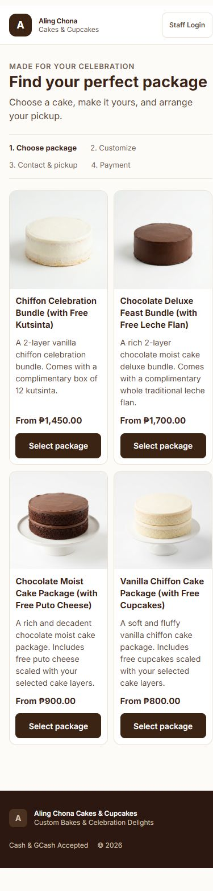
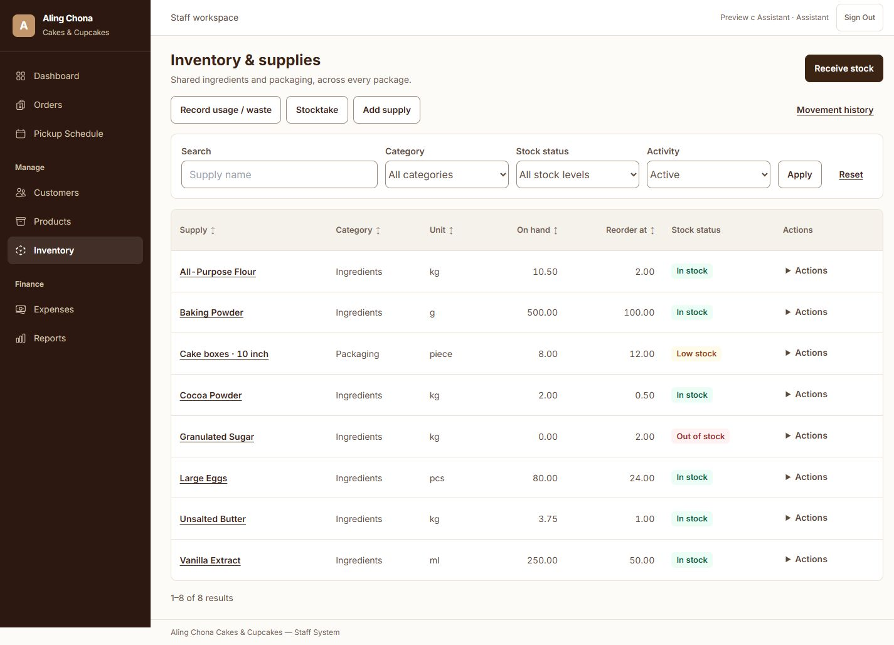
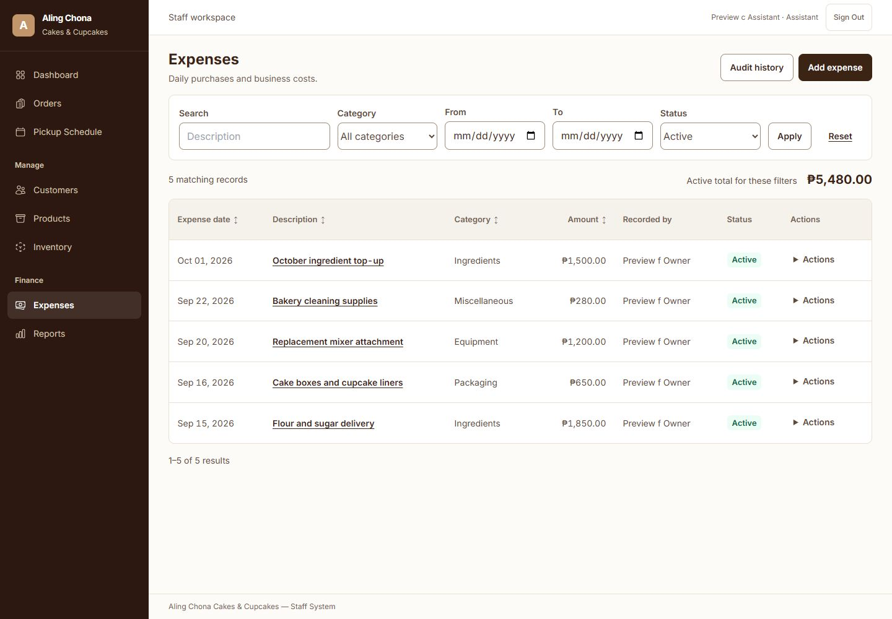
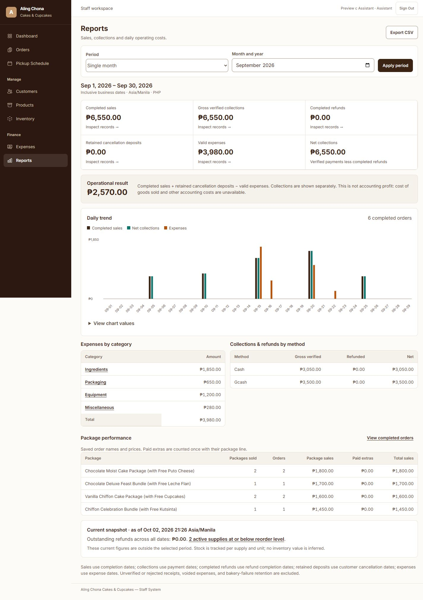

# Rendered workflow screenshots

Captured 2 October 2026 from the isolated `workflow-preview-20261002.sqlite` fixture. Names, phone numbers, receipts and order references are test data. These are the actual Laravel/Blade screens; values differ between captures as verification operations were posted.

Widths label the configured browser viewport. Full-page image capture excludes the 15px vertical scrollbar when present, so those JPEGs are 15px narrower than the viewport label.

## Key desktop and mobile screens

| Workflow | Phone | Desktop |
|---|---|---|
| Catalog | [390px](screenshots/catalog-390.jpg) | [1440px](screenshots/catalog-1440.jpg) |
| Dedicated customization | [390px](screenshots/customize-390.jpg) | [1440px](screenshots/customize-1440.jpg) |
| Inventory workspace | [390px](screenshots/inventory-390.jpg) | [1440px](screenshots/inventory-1440.jpg) |
| Expenses workspace | [390px](screenshots/expenses-390.jpg) | [1440px](screenshots/expenses-1440.jpg) |
| Reports | [390px](screenshots/reports-390.jpg) | [1440px](screenshots/reports-1440.jpg) |

## Responsive evidence at all requested widths

| Width | Catalog | Inventory | Expenses | Reports |
|---:|---|---|---|---|
| 360 | [Image](screenshots/catalog-360.jpg) | [Image](screenshots/inventory-360.jpg) | [Image](screenshots/expenses-360.jpg) | [Image](screenshots/reports-360.jpg) |
| 390 | [Image](screenshots/catalog-390.jpg) | [Image](screenshots/inventory-390.jpg) | [Image](screenshots/expenses-390.jpg) | [Image](screenshots/reports-390.jpg) |
| 430 | [Image](screenshots/catalog-430.jpg) | [Image](screenshots/inventory-430.jpg) | [Image](screenshots/expenses-430.jpg) | [Image](screenshots/reports-430.jpg) |
| 768 | [Image](screenshots/catalog-768.jpg) | [Image](screenshots/inventory-768.jpg) | [Image](screenshots/expenses-768.jpg) | [Image](screenshots/reports-768.jpg) |
| 1024 | [Image](screenshots/catalog-1024.jpg) | [Image](screenshots/inventory-1024.jpg) | [Image](screenshots/expenses-1024.jpg) | [Image](screenshots/reports-1024.jpg) |
| 1440 | [Image](screenshots/catalog-1440.jpg) | [Image](screenshots/inventory-1440.jpg) | [Image](screenshots/expenses-1440.jpg) | [Image](screenshots/reports-1440.jpg) |

Normal phone text keeps two catalog columns. Enlarged text can use one column to retain readable names, prices and actions. Operational tables scroll within their own container.

## Interaction evidence

| Capture | What it shows |
|---|---|
| [Enlarged text at 360px](screenshots/catalog-enlarged-360.jpg) | 32px root font, essential card information wraps without page overflow. |
| [Public checkout at 390px](screenshots/checkout-390.jpg) | Existing contact/pickup stage with saved line configuration. |
| [Public payment at 390px](screenshots/payment-preview-390.jpg) | Submitted preview order remains unpaid; existing payment setup/verification flow. |
| [Staff checkout at 1440px](screenshots/staff-checkout-1440.jpg) | Shared layers, quantity, theme, included items, extra and exact deposit. |
| [Created staff order at 1440px](screenshots/staff-order-created-1440.jpg) | Saved package price and independent extra; unpaid order, payment action retained. |
| [Inventory no results at 390px](screenshots/inventory-no-results-390.jpg) | Clear empty search feedback. |
| [Three-line receiving at 1440px](screenshots/receive-stock-1440.jpg) | Flour, sugar and boxes with per-unit quantity and stock-change preview. |
| [Posted receipt at 1440px](screenshots/receipt-posted-1440.jpg) | One operation with all three traceable before/after movements. |
| [Stock validation at 1440px](screenshots/stock-validation-1440.jpg) | Rejected waste beyond available stock, preserved fields and inline error. |
| [Stocktake at 1440px](screenshots/stocktake-1440.jpg) | Recorded quantity, actual count, difference and adjustment reason. |
| [Expense audit at 1440px](screenshots/expense-audit-1440.jpg) | Creation, reasoned edit and void, original creator and immutable audit history. |
| [Sales drill-down at 1440px](screenshots/report-drilldown-1440.jpg) | Records supporting the September completed-sales total. |
| [Invalid report range at 1440px](screenshots/report-invalid-range-1440.jpg) | Inline reversed-range error while preserving selected fields. |

The supplementary `receive-stock-455.jpg` records an earlier narrow preview; it is not evidence of a 1440px viewport. Use the explicitly labelled six-width table above for responsive comparisons.

## Selected previews

Mobile catalog:

Inventory workspace:

Expense workspace:

Reports:

